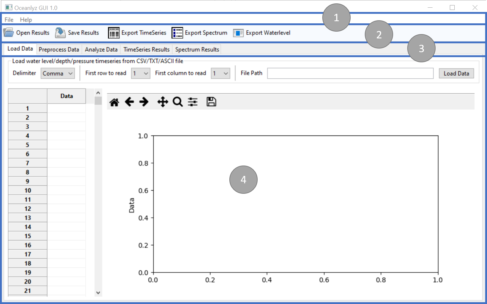

OCEANLYZ GUI Interface
======================

OCEANLYZ GUI has 4 main sections:

1. Menu bar
2. Toolbar
3. Tabs
4. Working space

    Figure: OCEANLYZ GUI Interface

Panel 1
-------

Panel 1 contains main menu bar.

Panel 2
-------

Panel 2 contains toolbar.

Panel 3
-------

Panel 3 contains GUI tabs.
OCEANLYZ GUI uses a tab interface for its workflow.
It contains following tabs:

Load Data tab
    Load (import) measured (raw) data into the application.

Preprocess Data tab
    Clean loaded data before start analyzing them.

Analyze Data tab
    Define analysis parameters and start analyzing data.

TimeSeries Results tab
    Shows and plots time-series results.

Spectrum Results tab
    Shows and plots spectral analysis results.

Panel 4
-------

Panel 4 shows workplace. Each tab has its own workplace. 
