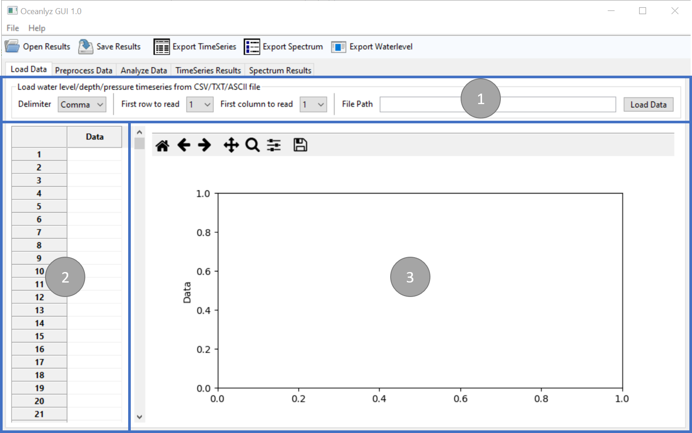

Load Data
=========

The first tab in OCEANLYZ GUI provides tools to load (import) measured (raw) data into the application.

    Figure: Load Data tab

Panel 1
-------

Panel 1 contains tools to load (import) measured (raw) data from a file.
It can import CSV, TXT, or ASCII files.

Delimiter
    Define delimiter (separator) that separates data

    * Comma
    * Space
    * Tab

First row to read
    Define the first row that data start to be imported from that row

First column to read
    Define the first column that data start to be imported from that column

Load Data
    Define (select) the file that contains measured (raw) data

Panel 2
-------

Panel 2 shows the first 1000 loaded (imported) data points for inspection.

Panel 3
-------

Panel 3 plots the first 1000000 loaded (imported) data points for inspection.
