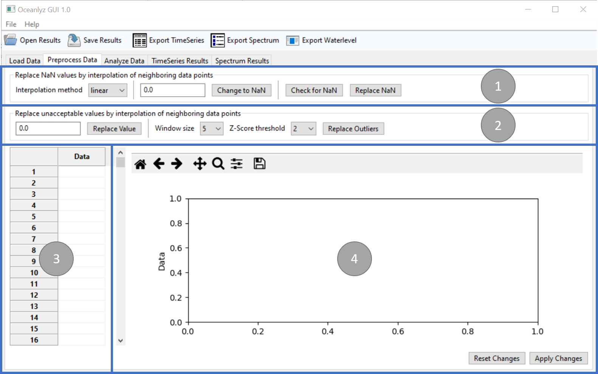

Preprocess Data
===============

The second tab in OCEANLYZ GUI provides tools to clean loaded data before start analyzing them.

    Figure: Preprocess Data tab

Panel 1
-------

Panel 1 contains tools to replace NaN (Not a Number) values by interpolation of neighboring data points.

Interpolation method
    Define interpolation method to replace NaN values

        linear
            Replace NaN values using linear interpolation
        nearest
            Replace NaN values with nearest neighbors

Change to NaN
    Define a value to marked as NaN

    This helps to mark unacceptable values as NaN.
    For example, sensors commonly use predefined value such as -999 to mark missing data.
    Now, that value such as -999 can be marked as NaN by using Change to NaN.

Check for NaN
    Check loaded data for existence of NaN values

Replace NaN
    Replace NaN values by interpolation of neighboring data points

Panel 2
-------

Panel 2 contains tools to replace unacceptable values by interpolation of neighboring data points.

Replace Value
    Define a value to be replaced by interpolation of neighboring data points

    This helps to replace unacceptable values.
    For example, sensors commonly use predefined value such as -999 to mark missing data.
    Now, that value such as -999 can be replaced by using Replace Value.

Window size
    Define a window size used for identifying and replacing outliers

    For example, if window size is 5, then 5 data points (2 on each side of data point plus data point itself) are used to identify if that data point is outlier or not.

Z-Score threshold
    Define a Z-Score threshold used for identifying and replacing outliers

Replace Outliers
    Define outlier values using Z-Score and replace them by interpolation of neighboring data points

    Note: It uses interpolation method defined in panel 1

Panel 3
-------

Panel 3 shows the first 1000 cleaned data points for inspection.

Panel 4
-------

Panel 4 plots the first 1000000 cleaned data points for inspection.
