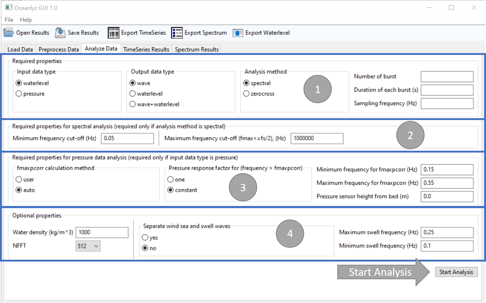

Analyze Data
============

In the third tab of OCEANLYZ GUI, analysis parameters are defined and data analysis is started.

For technical detail visit https://oceanlyz.readthedocs.io 

    Figure: Analyze Data tab

Panel 1
-------

Panel 1 contains parameters that should be set for any analysis.

Input data type (InputType='waterlevel')
    Define input data type
        InputType='waterlevel': Input data is water level or water depth in (m)
            If InputType='waterlevel' then OutputType='wave'
        InputType='pressure': Input data are water pressure measured by a pressure sensor at sensor depth in (N/m^2)
            If InputType='pressure' then OutputType='waterlevel' or OutputType='wave+waterlevel'

Output data type (OutputType='wave')
    Define output data type
        | OutputType='wave': Calculate wave properties from water level or water depth data
        | OutputType='waterlevel': Calculate water level data from water pressure data measured by a pressure sensor
        | OutputType='wave+waterlevel': Calculate waves properties and water level data from water pressure data measured by a pressure sensor
        
Analysis method (AnalysisMethod='spectral')
    Analysis method
        | AnalysisMethod='spectral': Use spectral analysis method / Fast Fourier Transform
        | AnalysisMethod='zerocross': Use zero-crossing method

Number of burst (n_burst=1)
    Number of burst(s) in the input file
        | n_burst = (total number of data points)/(burst_duration*fs)
        | Example:

            | Assume data are collected for 6 hours at a sampling frequency of fs=10 Hz
            | If data are analyzed at intervals of 30 minutes then there are 12 bursts (6 hours/30 minutes=12 bursts)
            | For 12 bursts of data, which each burst has a duration of 30 minutes, and collected at sampling frequency of fs=10 Hz 
            | burst_duration=(30 min * 60) = 1800 seconds
            | total number of data points=(number of burst)*(duration of each burst)*(sampling frequency)
            | total number of data points=(n_burst)*(burst_duration)*(fs)
            | total number of data points=12 * 1800 * 10

Duration of each burst (burst_duration=1024)
    Duration time that data collected in each burst in (second)

Sampling frequency (fs=2)
    Sampling frequency that data are collected at in (Hz)
        
Panel 2
-------

Panel 2 contains parameters that are required for spectral analysis.
In other words, these parameters are required only if analysis method is set to spectral.

Minimum frequency cut-off (fmin=0.05)
    Minimum frequency to cut off the spectrum below that, i.e. where f<fmin, in (Hz)
        | Results with frequency f<fmin will be removed from analysis
        | It should be between 0 and (fs/2)
        | It is a simple high pass filter
        | Only required if AnalysisMethod='spectral'

Maximum frequency cut-off (fmax=1e6)
    Maximum frequency to cut off the spectrum beyond that, i.e. where f>fmax, in (Hz)
        | Results with frequency f>fmax will be removed from analysis
        | It should be between 0 and (fs/2)
        | It is a simple low pass filter
        | Only required if AnalysisMethod='spectral'

Panel 3
-------

Panel 3 contains parameters that are required for pressure data analysis.
In other words, these parameters are required only if input data type is set to pressure.

fmaxpcorr calculation method (fmaxpcorrCalcMethod='auto')
    Define if to calculate fmaxpcorr and ftail or to use user defined
        | fmaxpcorrCalcMethod='user': use user defined value for fmaxpcorr
        | fmaxpcorrCalcMethod='auto': automatically define value for fmaxpcorr
        | Only required if InputType='pressure' and AnalysisMethod='spectral'

Pressure response factor for (f > fmaxpcorr), (Kpafterfmaxpcorr='constant')
    Define a pressure response factor, Kp, value for frequency larger than fmaxpcorr
        | Kpafterfmaxpcorr='one': Kp=1 for frequency larger than fmaxpcorr 
        | Kpafterfmaxpcorr='constant': Kp for f larger than fmaxpcorr stays equal to Kp at fmaxpcorr (constant)
        | Kpafterfmaxpcorr='nochange': Kp is not changed for frequency larger than fmaxpcorr (Not implemented yet)
        | Only required if InputType='pressure' and AnalysisMethod='spectral'

Minimum frequency for fmaxpcorr (fminpcorr=0.15)
    Minimum frequency that automated calculated fmaxpcorr can have if fmaxpcorrCalcMethod='auto' in (Hz)
        | If fmaxpcorrCalcMethod='auto', then fmaxpcorr will be checked to be larger or equal to fminpcorr
        | It should be between 0 and (fs/2)
        | Only required if InputType='pressure' and AnalysisMethod='spectral'

Maximum frequency for fmaxpcorr (fmaxpcorr=0.55)
    Maximum frequency for applying pressure attenuation factor in (Hz)
        | Pressure attenuation factor is not applied on frequency larger than fmaxpcorr
        | It should be between 0 and (fs/2)
        | Only required if InputType='pressure' and AnalysisMethod='spectral'

Pressure sensor height from bed (heightfrombed=0.0)
    Pressure sensor height from a bed in (m)
        Leave heightfrombed=0.0 if data are not measured by a pressure sensor or if a sensor sits on the seabed
        | Only required if InputType='pressure'

Panel 4
-------

Panel 4 contains parameters that are optional.

Water density (Rho=1000)
    Water density (kg/m^3)
        Only required if InputType='pressure'

NFFT (nfft=512)
    Define number of data points in discrete Fourier transform
        | Should be 2^n
        | Results will be reported for frequency range of 0 <= f <= (fs/2) with (nfft/2+1) data points
        | Example: If fs=4 Hz and nfft=512, then output frequency has a range of 0 <= f <= 2 with 257 data points
        | Only required if AnalysisMethod='spectral'

Separate wind sea and swell waves (SeparateSeaSwell='no')
    Define if to separate wind sea and swell waves or not
        | SeparateSeaSwell='yes': Does not separate wind sea and swell waves
        | SeparateSeaSwell='no': Separates wind sea and swell waves

Maximum swell frequency (fmaxswell=0.25)
    Maximum frequency that swell can have (It is about 0.2 in Gulf of Mexico) in (Hz)
        | It should be between 0 and (fs/2)
        | Only required if SeparateSeaSwell='yes' and AnalysisMethod='spectral'

Minimum swell frequency (fpminswell=0.1)
    Minimum frequency that swell can have (it is used for Tpswell calculation) in (Hz)
        | It should be between 0 and (fs/2)
        | Only required if SeparateSeaSwell='yes' and AnalysisMethod='spectral'

Start Analysis
--------------

To start analysis click Start Analysis button.
Note: depend on the size of data and analysis method, analysis may take a while.
        