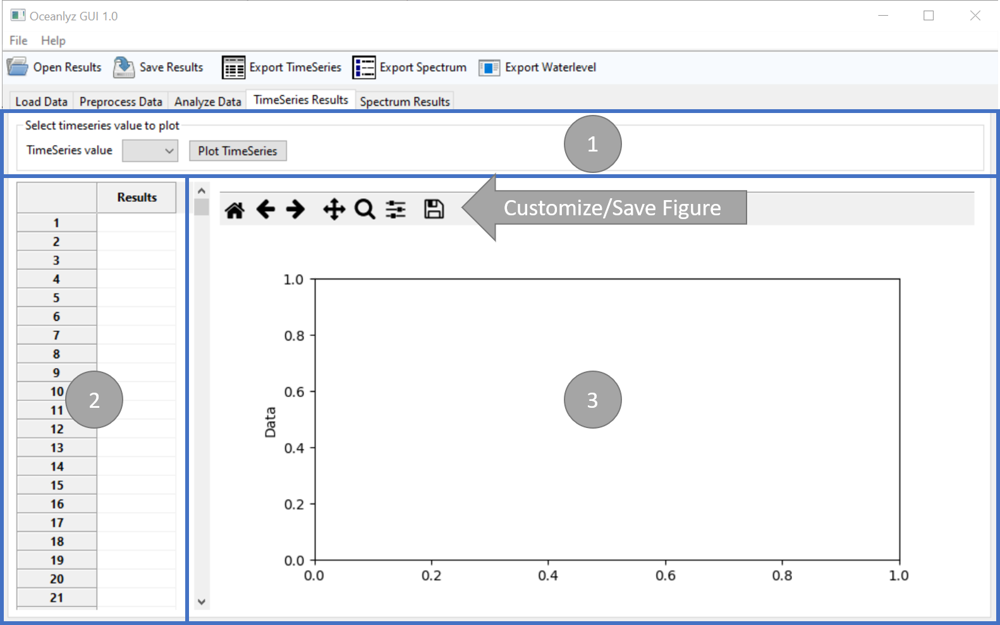

Time-Series Results
===================

In the fourth tab of OCEANLYZ GUI, time-series results can be shown and plotted.

    Figure: TimeSeries Results tab

Panel 1
-------

Time-series values to be shown/plotted can be selected in panel 1.

Time-series values for spectral analysis are some or all of the followings (Depend on analysis parameters):

    Hm0
        Zero-moment wave height (m)
    Tp
        Peak wave period (s)
    fp
        Peak wave frequency (Hz)
    Hm0sea
        Zero-moment wave height for wind sea (m)
    Hm0swell
        Zero-moment wave height for swell waves (m)
    Tpsea
        Peak wave period for wind sea (s)
    Tpswell
        Peak wave period for swell waves (s)
    fseparation
        wind sea and swell waves separation frequency (Hz)

Time-series values for zero-crossing analysis are:

    Hs
        Significant wave height (m)
    Hz
        Zero-crossing mean wave height (m)
    Tz
        Zero-crossing mean wave period (s)
    Ts
        Significant wave period (s)

Panel 2
-------

Panel 2 shows the time-series results.

Panel 3
-------

Panel 3 plots the time-series results.
Plots can be customized or saved by using the plot toolbar located on top of the figure.
        