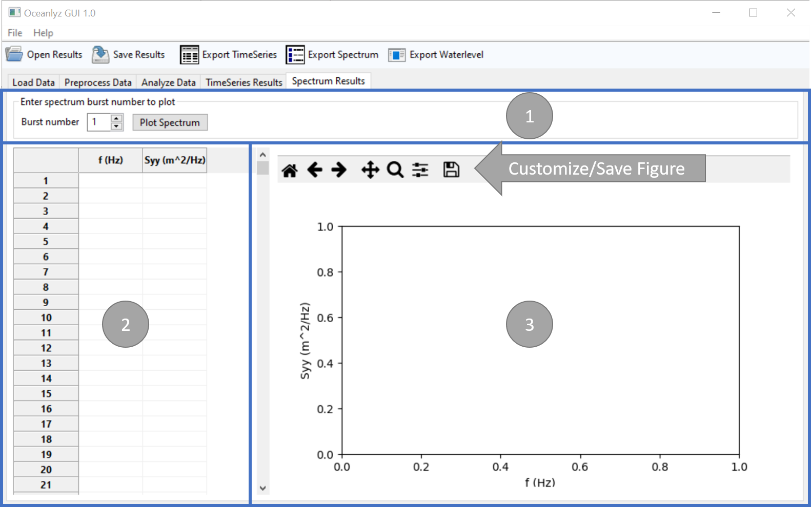

Spectrum Results
================

In the fifth tab of OCEANLYZ GUI, spectral results can be shown and plotted.

    Figure: Spectrum Results tab

Panel 1
-------

Spectrum values to be shown/plotted can be selected in panel 1.

Spectrum values for spectral analysis are:

    f
        Frequency (Hz)
    Syy
        Wave power spectral density (m^2/Hz)

Panel 2
-------

Panel 2 shows the spectrum results.

Panel 3
-------

Panel 3 plots the spectrum results.
Plots can be customized or saved by using the plot toolbar located on top of the figure.
        