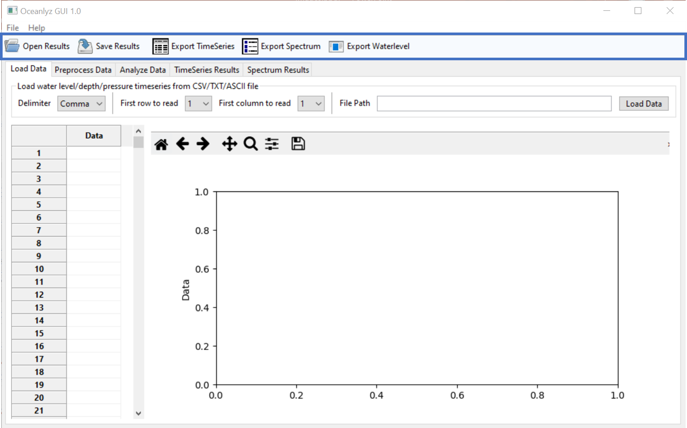
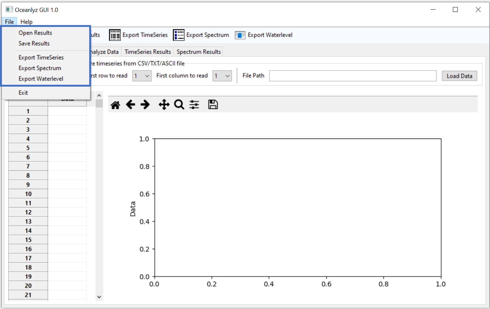

Save, Open, and Export Results
==============================

Analyzed results can be save, export, or open through GUI toolbar or File menu.

    Figure: OCEANLYZ GUI Toolbar

    Figure: OCEANLYZ File Menu

Save and Open Results
---------------------

To save results click on Save Results on toolbar or File menu.
Results will be saved as Python pickle object with .pkl extension.
These file maybe later open in OCEANLYZ GUI or in any programming language that support Python pickle objects.

To save results:

    | OCEANLYZ GUI Toolbar > Save Results
    | File Menu > Save Results

To open saved results:

    | OCEANLYZ GUI Toolbar > Open Results
    | File Menu > Open Results

Configurations File
-------------------

When results are saved as Python pickle object, another file containing analysis configurations will be saved along that.
This file is named as:

    saved_file_name_config.txt

where, saved_file_name is the name of the saved results file.

Export Results
--------------

Results can be exported as CSV (comma-separated values) file from OCEANLYZ GUI toolbar or File menu.
These file maybe later open in in any application that support CSV file.

Note: The available results for exporting depend on parameters used for analysis. 

To export time-series results:

    | OCEANLYZ GUI Toolbar > Export TimeSeries
    | File Menu > Export TimeSeries

To export spectrum results:

    | OCEANLYZ GUI Toolbar > Export Spectrum
    | File Menu > Export Spectrum

To export water-level results:

    | OCEANLYZ GUI Toolbar > Export Waterlevel
    | File Menu > Export Waterlevel
