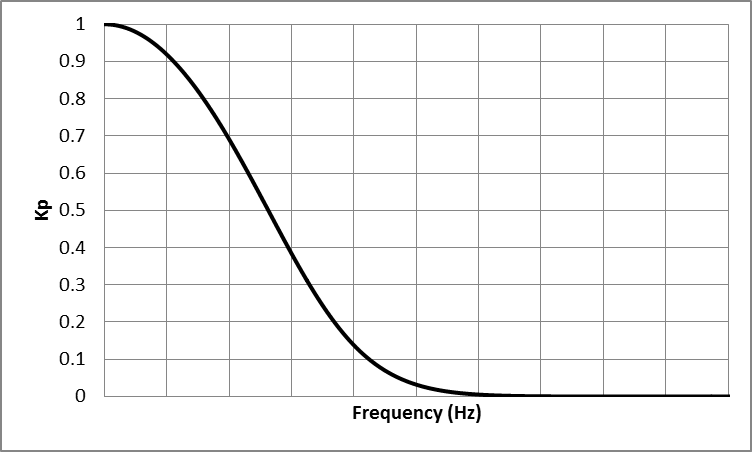
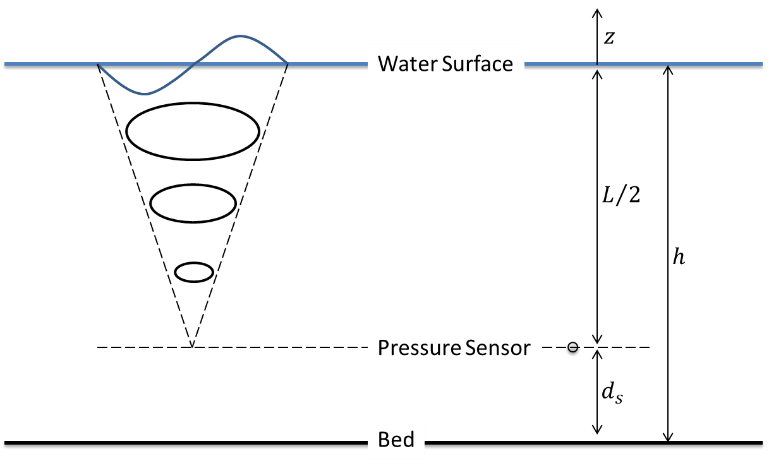

Correct Data Measured by Pressure Sensor
========================================

Dynamic pressure from water wave will attenuate by moving from a water surface toward a seabed. Because of that, data collected by a pressure sensor have lower magnitudes compared to actual pressure values. To fix this issue and account for the pressure loss in the water column, pressure data collected by a pressure sensor should be divided by a pressure response factor. To do that, first, pressure data should be converted to water depth as:

|

.. math::

    h_{sensor}=\frac{P}{\rho g}+d_s 

|

Then, data are corrected as:

|

.. math::

    h=\frac{h_s{ensor}}{K_P}  

|

.. math::

    K_P=\frac{\cosh(kd_s)}{\cosh(kh_m)}  

|

where, :math:`h_sensor` is water depth read by a pressure sensor, P is pressure, :math:`K_P` is a pressure response factor, k is a wavenumber, :math:`h_m` is a mean water depth, and d_s is a distance of the sensor location from a seabed.

One method to use these equations to correct the data is to use them on every single wave. To do that, a zero-crossing method is used to calculate :math:`K_P` for every single wave. Then, :math:`K_P` can be applied to each wave height or on water level time series corresponded to each wave. 

Another method to use these equations to correct the data is to use Fast Fourier transform and convert a time series to the frequency domain, and then applying :math:`K_P` on each frequency. In that case, calculated :math:`K_P` in the frequency domain decreases from 1 to 0 as frequency, f, increases (Figure 1). It means that, a value of :math:`1/K_P` will be 1 for f=0, and increases toward infinity as a frequency increases. Because of that, if :math:`K_P` applies to an entire frequency domain, it results in will have very large values in the high frequency region. To avoid that, lower and upper limits for frequencies should be considered, where :math:`K_P` is not applied to raw data outside of that range.

 

    Figure 1: Schematic trend of :math:`K_P` versus f

A lower-frequency limit for applying :math:`K_P` is the smallest frequency that is available in a time series such as f=0.04 to f=0.05 Hz. But an upper-frequency limit is depending on the deployment situations. As it was pointed out, wave pressure attenuates from a water surface toward a seabed (Figure 2). As a wave gets smaller (its frequency increases) it damps in water depth sooner. Because of that, there is a limit that a wave smaller than that (wave with larger frequency than that limit) cannot be sensed by a sensor, as their effect is damped completely before reaching a sensor depth. In that case, :math:`K_P` should only apply to a range of frequencies that their effects reach a sensor location. So, for any case, depending on deployment situations, a range of frequencies that are large enough to reach a sensor should be calculated, and :math:`K_P` only applies to that range. 

 

    Figure 2: Schematic of sensor deployment setup

To calculate a maximum frequency that :math:`K_P` should be applied, deep-water condition can be considered as :math:`h=\frac{L}{2}` or :math:`kh=\pi`. Considering a sensor setup as described in Figure 2, it can be written:

|

.. math::

    h-d_s=\frac{L}{2}\  or\  k(h-d_s)=\pi\  so\  k=\frac{\pi}{(h-d_s)} 
 
|

.. math::

    K_{P-min}(h,d_s)=\frac{\cosh(k(h+z))}{\cosh(kh)}=\frac{\cosh(kd_s)}{\cosh(kh)}=\frac{\cosh(\frac{d_s}{(h-d_s)}\pi)}{\cosh(\frac{h}{(h-d_s)}\pi)} 

|

Then, a maximum frequency that :math:`K_P` should apply to data up to that frequency is:

|

.. math::

    \omega^2=gk \tanh(kh) 

|

.. math::

    (2\pi f)^2=gk \tanh(kh) 

|

.. math::

    f=\frac{\sqrt{gk \tanh(kh)}}{2\pi}

|

.. math::

    f_{max(for\ pressure\ correction)}=\frac{\sqrt{g\frac{\pi}{(h-d_s)} \tanh(\frac{h}{(h-d_s)}\pi)}}{2\pi}

|

For the case that a pressure sensor sits on a seabed (i.e.  :math:`d_s=0` and :math:`kh=\pi`), the :math:`K_{P-min}` and :math:`f_{max(for\ pressure\ correction)}` are:

|

.. math::

    K_{P-min}(h,0)=\frac{\cosh(0)}{\cosh(\pi)}=0.0863 

|

.. math::

    f_{max(for\ pressure\ correction)}=\frac{\sqrt{g \frac{\pi}{h} \tanh(\pi)}}{2\pi}

|

Figures 3 and 4 show the maximum frequency that :math:`K_P` should not apply beyond that frequency.

For more details on this topic refer to Karimpour and Chen (2017) and Karimpour (2018).

 
.. figure:: figures/Figure_Max_fr_vs_Sensor_Depth.png

    Figure 3: Maximum frequency that :math:`K_P` should not applied beyond that frequency.

 
.. figure:: figures/Figure_Max_fr_vs_Water_Depth.png

    Figure 4: Maximum frequency that :math:`K_P` should not apply beyond that frequency, for a sensor sitting on a seabed.

References
----------

* Karimpour, A., & Chen, Q. (2017). Wind Wave Analysis in Depth Limited Water Using OCEANLYZ, a MATLAB toolbox. Computers & Geosciences, 106,181-189.
* Karimpour A., (2018), Ocean Wave Data Analysis: Introduction to Time Series Analysis, Signal Processing, and Wave Prediction, KDP.
