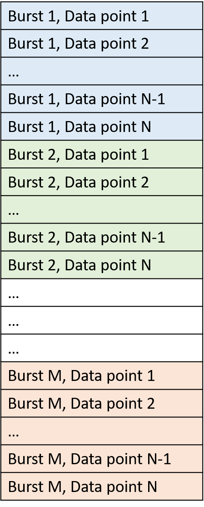
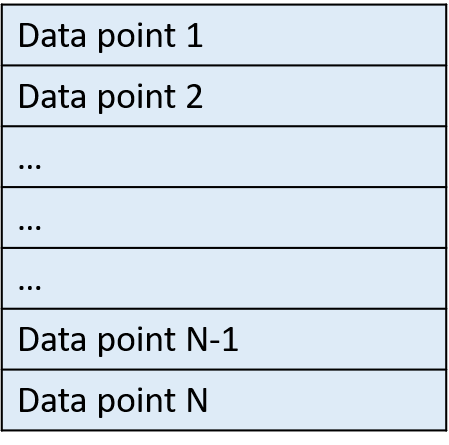

Prepare Input Data File (MATLAB and Python)
===========================================

This section explains about a format of input data that is being used in a calculation. Input data may contains a time-series of water surface elevation, water depth, or water pressure.

For MATLAB version of toolbox, input data should be prepared as a 1-d vector (column array with only one column).

For Python version of toolbox, input data should be prepared as a 1-d array.

Input data should not contain any text. The schematics of input data for data recorded in a burst mode and a continuous mode are demonstrated in following sections. 

Data Recorded in Burst Mode
---------------------------

If data are recorded in a burst mode, it means that data are collected for a specific duration (burst), then followed by idle duration (no data are collected), then followed by another recording period, and so on. In the burst measurement, this pattern of recording/not recording is repeated throughout the measurement. This usually is used in cases that we need to save battery and memory.

For example, an instrument may set to record data for 20 minutes and then goes to sleep to save the battery and memory for 40 minutes, before it wakes up again and repeats the recording/sleeping procedure again and again.

Assuming we have M bursts of data, and each burst contains N data points, then a schematic of input data array is:

    Figure: Single column data input for data recorded in burst mode

In the burst mode:

* M : The total number of bursts
* N : The total number of samples in each burst
* d : The duration of each burst in seconds
* fs: The sampling frequency that data are collected

The total number of samples in each burst (N) is:

.. math::

    N = fs \times d  

The total number of samples in input file is:

.. math::

    fs \times d \times M  

And an input data array has a size of:

.. math::

    (fs \times d \times M , 1)

Data Recorded in Continuous Mode:
---------------------------------

If data are recorded in a continuous mode, it mean that data are recorded in one run without any gap throughout the measurement.

If the total number of recorded data points is equal to N, then a schematic of input data array is:
 

    Figure: Single column data input for data recorded in continuous mode

In the continuous mode:

* N : The total number of samples in dataset
* d : The duration of measurement in seconds
* fs: The sampling frequency that data are collected

The total number of samples in input file (N) is:

.. math::

    N = fs \times d  

And an input data array has a size of:

.. math::

    (fs \times d , 1)

Analyze Continuous Data as Burst Data:
--------------------------------------

If data in a continuous mode are collected for a long period, then we may need to split it into several blocks data and analyze each block separately. In such cases, we may consider each of these data block as one burst.

To define a number of bursts when data are collected in a continuous mode, first, we need to define a length (duration) of each burst (data block). Then, the total number of bursts is obtained by dividing the total duration that data are collected by a duration one burst.

For example, consider data that were recorded continuously for 24 hours. Now, assume we want to split data into blocks of 30 minutes. Here, each 30 minutes of data is one burst. Now, the total number of bursts in this case is equal to the 24 hours divided by 0.5 hour (30 minutes), i.e. (24 / 0.5)=48. In this example, a duration of each burst is (30 * 60) seconds and therefore the total number of samples in each burst is (fs * 30 * 60).
