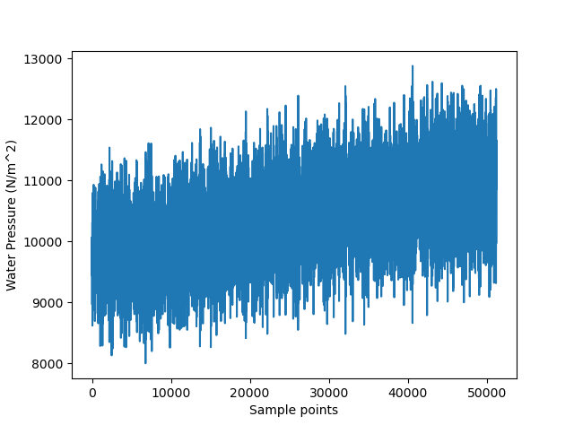
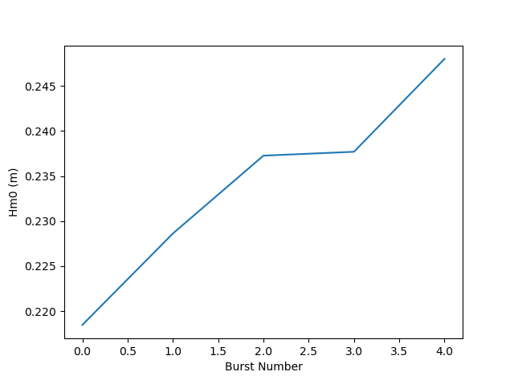
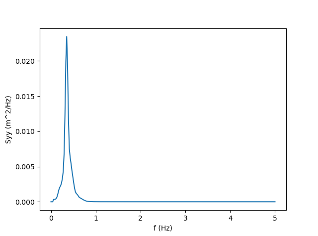

Example (Python Version)
========================

Here is an example shows how to use OCEANLYZ. In this example, we use a provided sample file “waterpressure_5burst.csv” as input data.
This sample file contains five bursts of water pressure data recorded with a pressure sensor.
Sample file may be downloaded at https://github.com/akarimp/oceanlyz/releases/tag/2.0 .

Measurement properties for “waterpressure_5burst.csv” are:

===============================================   ========================   ========================
Properties                                        Value                      OCEANLYZ Properties
===============================================   ========================   ========================
File name                                         waterpressure_5burst.csv
Data type                                         Water pressure             obj.InputType='pressure'
Number of recorded burst (n_burst)                5                          obj.n_burst=5
Sampling frequency (fs)                           10 (Hz)                    obj.fs=10
Recording duration (burst_duration)               1024 (second)              obj.burst_duration=1024
Pressure sensor height from bed (heightfrombed)   0.05 (m)                   obj.heightfrombed=0.05
Mean water depth (h)                              Varies in each burst
===============================================   ========================   ========================

To start using OCEANLYZ, first, we need to be import required libraries. Remember, Python version of OCEANLYZ is part of ScientiMate, and therefore, we need to import ScientiMate to use OCEANLYZ:

.. code:: python

    #Import libraries
    import scientimate as sm
    import os
    import numpy as np
    import matplotlib.pyplot as plt

Next, we download water pressure dataset (“waterpressure_5burst.csv”), we unzip it and copy sample files in a desired folder. 

Assume downloaded sample data file is stored in 'C:\\oceanlyz_python\\Sample_Data'. Then, we load data as:

.. code:: python

    os.chdir('C:\\oceanlyz_python\\Sample_Data') #Change current folder to a folder that contains data file
    water_pressure = np.genfromtxt('waterpressure_5burst.csv') #Load data

We can plot data if we need to as:

.. code:: python

    plt.plot(water_pressure)
    plt.xlabel('Sample points')
    plt.ylabel('Water Pressure (N/m^2)')

    Figure 1: Plot of input water pressure data

Then, we need to create an OCEANLYZ object as:

.. code:: python

    #Create OCEANLYZ object
    ocn = sm.oceanlyz()

Next, we assign wave data to OCEANLYZ object as:

.. code:: python

    #Input data
    ocn.data = water_pressure.copy()

Now, we set up OCEANLYZ properties as:

.. code:: python

    ocn.InputType='pressure'
    ocn.OutputType='wave+waterlevel'
    ocn.AnalysisMethod='spectral'
    ocn.n_burst=5
    ocn.burst_duration=1024
    ocn.fs=10
    ocn.fmin=0.05
    ocn.fmax=ocn.fs/2
    ocn.fmaxpcorrCalcMethod='auto'   #Only required if ocn.InputType='pressure'
    ocn.Kpafterfmaxpcorr='constant'  #Only required if ocn.InputType='pressure'
    ocn.fminpcorr=0.15               #Only required if ocn.InputType='pressure'
    ocn.fmaxpcorr=0.55               #Only required if ocn.InputType='pressure'
    ocn.heightfrombed=0.05           #Only required if ocn.InputType='pressure'
    ocn.dispout='yes'
    ocn.Rho=1024                     #Seawater density (Varies)

After all required properties are set, we can run OCEANLYZ as:
  
.. code:: python

    ocn.runoceanlyz()

Output is stored as a structure array. Name of output is 'oceanlyz_object.wave'. Field(s) in this structure array can be called by using '.'
For example oceanlyz_object.wave.Hm0 contains zero-moment wave height and oceanlyz_object.wave.Tp contains peak wave period.

Here we show how to plot zero-moment wave height:

.. code:: python

    Hm0 = ocn.wave['Hm0'] #zero-moment wave height
    plt.plot(Hm0)
    plt.xlabel('Burst Number')
    plt.ylabel('Hm0 (m)')

    Figure 2: Plot of :math:`H_{m0}` versus burst number

Similarly, we can plot wave spectrum for the first burst:

.. code:: python

    f = ocn.wave['f'] #frequency of the first burst
    Syy = ocn.wave['Syy'] #spectrum of the first burst
    plt.plot(f[0,:],Syy[0,:])
    plt.xlabel('f (Hz)')
    plt.ylabel('Syy (m^2/Hz)')

    Figure 3: Plot of :math:`S_{yy}` versus f

Notes
-----

Note1: 
    If data are collected in continuous mode and you need to analyze them in smaller blocks, you can analyze it in a burst mode. For that, you choose n_burst and burst_duration as follow:

    The burst_duration is equal to a period of time that you want data analyzed over that. For example, if you need wave properties reported every 15 min, then the burst_duration would be 15*60 second.

    the n_burst is equal to the total length of the time series divided by the burst_duration. The n_burst should be an integer. So, if the total length of the time series divided by the burst_duration leads to a decimal number, then data should be shortened to avoid that.

Note2: 
    Welch spectrum is used to calculate a power spectral density. In all spectral calculation, a default window function with a default overlap window between segments are used.

Note3: 
    If fmaxpcorrCalcMethod='auto', then OCEANLYZ calculates fmaxpcorr based on water depth and a sensor height from a seabed (refer to Applying Pressure Response Factor section). A maximum value for calculated fmaxpcorr will be limited to the value user set for fmaxpcorr.  
