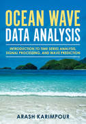

.. YA LATIF

.. OCEANLYZ documentation master file, created by
   sphinx-quickstart on Thu Jul 11 17:21:15 2019.
   You can adapt this file completely to your liking, but it should at least
   contain the root `toctree` directive.

OCEANLYZ Document
=================

OCEANLYZ, Ocean Wave Analyzing Toolbox

MATLAB / GNU Octave Toolbox

:Developer: Arash Karimpour
:Website: http://www.arashkarimpour.com
:Download: http://www.arashkarimpour.com/oceanlyz.html
:Documentation: https://oceanlyz.readthedocs.io
:Source code: https://github.com/akarimp/oceanlyz
:Report issues: https://github.com/akarimp/oceanlyz/issues
:Version: 1.4

.. :Date: July, 2019

|

OCEANLYZ, Ocean Wave Analyzing Toolbox, is a toolbox for analyzing the wave time series data collected by sensors in open body of water such as ocean, sea, and lake or in a laboratory.

.. toctree::
    :maxdepth: 2

    1_Introduction.rst
    2_Getting_Started.rst
    3_Prepare_Input_Data_File.rst
    4_Sample_Files.rst
    5_Apply_Pressure_Response_Factor.rst
    6_Apply_Diagnostic_Tail.rst
    7_References.rst

OCEANLYZ functions can be used as a standalone command in Matlab/GNU Octave command line or it can be embedded in Matalb/GNU Octave script file (.m file). Here are main OCEANLYZ functions:

.. toctree::
    :maxdepth: 1

    8_Functions.rst
    9_WaveSpectraFun.rst
    10_WaveZerocrossingFun.rst
    11_PcorFFTFun.rst
    12_PcorZerocrossingFun.rst
    13_SeaSwellFun.rst

OCEANLYZ changelog

.. toctree::
    :maxdepth: 1

    14_Changelog.rst

Recommended Book
----------------

For more details on coastal and ocean wave data analysis refer to:

Karimpour A., (2018), Ocean Wave Data Analysis: Introduction to Time Series Analysis, Signal Processing, and Wave Prediction, KDP.

Book link: https://www.amazon.com/dp/0692109978

    Figure: Ocean Wave Data Analysis

Search
==================

* :ref:`search`

.. * :ref:`genindex`
.. * :ref:`modindex`
